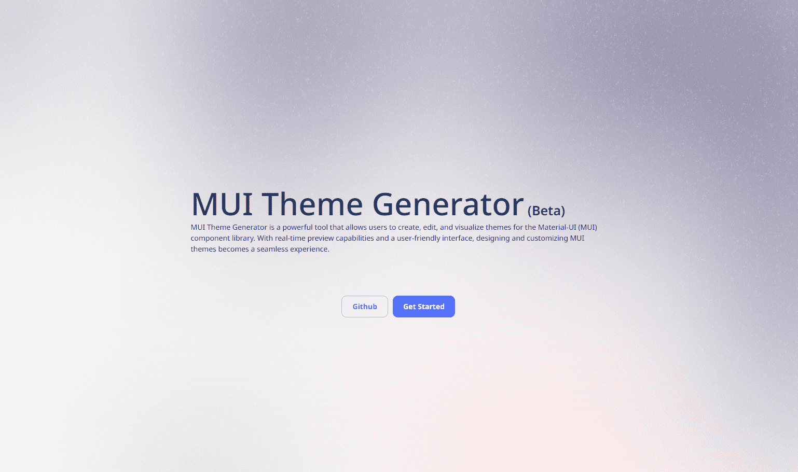

<h2 >Overview</h2>

  MUI Theme Generator is a powerful tool that allows users to create, edit, and visualize themes for the Material-UI (MUI) component library. With real-time preview capabilities and a user-friendly interface, designing and customizing MUI themes becomes a seamless experience.

<h2 >Features</h2>

- **Real-time Editing:** Make instant changes to your theme and witness the results in the side panel in real-time.

- **Save and Share:** Save your customized themes and explore a collection of community-made themes. Users can share their creations with the community and contribute to the theme repository.

- **Color Selection:** Easily edit and select colors for various MUI components, ensuring a personalized and visually appealing design.

- **Submission:** Users can submit their themes for community use, fostering collaboration and a diverse range of themes for the MUI library.

<h2>Todo:</h2>

- [ ] Create landing page
- [x] Add Monaco code editor
  - [ ] Improve code editor
- [ ] Components to preview panel
- [ ] Support for saving and submitting theme
- [ ] Import themes dynamically
- [ ] Community themes support
  - [ ] Add theme cards
  - [ ] Support for searching themes 
- [ ] Add support for Localization

<h2>Contributing</h2>

If you'd like to contribute to MUI Theme Generator, please follow the guidelines in [CONTRIBUTING.md](CONTRIBUTING.md).

<h2 >License</h2>

This project is licensed under the MIT License - see the [LICENSE](LICENSE) file for details.

<h2 >Acknowledgments</h2>

- [Material-UI](https://material-ui.com/): The foundation for building elegant and responsive web applications.

Happy theming!

